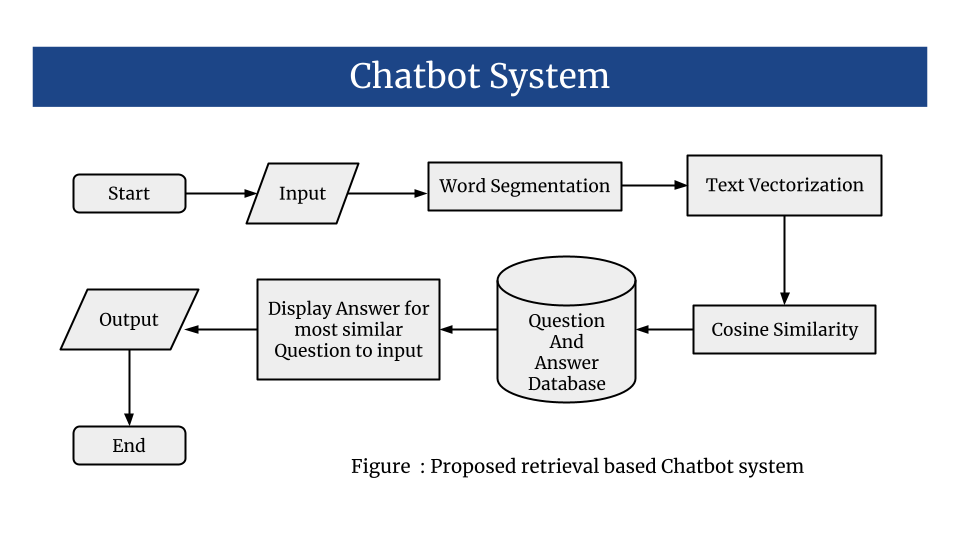
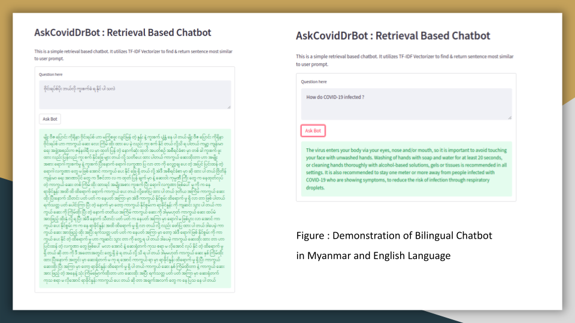

# AskCovidDrBot

## System Design
**AskCovidDrBot** is a retrieval based chatbot which will extract the most similar answer to the question the user asked. Input from the user will be vectorized by the vectorizer, which was trained on our collected question and answer paired corpus. After the text vectorization, the input text becomes a vector and string similarities between the question user asked and the answer we predefined would be compared.



## System GUI



## Install requirements
```{r, engine='bash', count_lines}
pip install -r requirements.txt
```
## How to run demo app
```{r, engine='bash', count_lines}
streamlit run app.py
```
## How to run bot.py
```{r, engine='bash', count_lines}
python bot.py
```

## How bot.py works
```{r, engine='bash', count_lines}
Greetings! I am a chatbot and I will try to answer your questions about COVID-19. If you want to exit, type Bye!
hi
Chatbot : hey
ကိုရိုနာ ဗိုင်းရပ်စ် ဆို တာ ဘာ ပါ လဲ        
Chatbot : ကိုရိုနာဗိုင်းရပ်စ် ဆို တာ လူ နဲ့ တခြား တိရစ္ဆာန် တွေ ကို ကူးစက် တတ် တဲ့ ဗိုင်းရပ်စ် တစ် မျိုး ဖြစ် ပါတယ် အကြမ်း အားဖြင့် လူသား တွေ အကြား မှာ ကူးစက် ပြန့်ပွား ပြီး ချောင်းဆိုးတာ ကိုယ်ပူတာ နဲ့ နှာရည် ယို တာ တွေ လို သာမန် အဖျား ရောဂါ နဲ့ ဆင်တူ တဲ့ လက္ခဏာ တွေ ကို ဖြစ် စေ ပါတယ် ခုနှစ် တုန်း က ဆော်ဒီ အာရေဗီးယား မှာ ပထမဦးဆုံး အတည်ပြု ခဲ့ တဲ့ လို့ ခေါ် တဲ့ ရောဂါ ကို ဖြစ်စေ တဲ့ အမျိုးအစား လို တချို့ ကို ရိုနာဗိုင်းရပ်စ် အမျိုးအစား တွေ ဟာ အဆုတ် ရောင်တာ နဲ့ တခြား ပြင်းထန် တဲ့ ရောဂါ လက္ခဏာ တွေ ကို ဖြစ်ပွား စေ နိုင် ပါ တယ် အခု ကမ္ဘာ့ ကပ်ရောဂါ ဖြစ်စေ တဲ့ ကို ရိုနာဗိုင်းရပ်စ် က တော့ အမျိုးအစား အသစ် ဖြစ် ပါတယ် ကူးစက်ခံ ရ သူ တွေ ဟာ ကိုယ် အပူချိန် မြင့် တာ ချောင်းဆိုး တာ ပင်ပန်း နွမ်းနယ်တာ အသက်ရှူမဝတာလည် ချောင်းနာတာ နဲ့ ခေါင်း ကိုက်တာ တွေ စတဲ့ လက္ခဏာ တွေ ဖြစ်ပေါ် ပါ တယ် လူနာ တွေ ရဲ့ ရာခိုင်နှုန်း လောက်ဟာ မပြင်းထန် တဲ့ လက္ခဏာ တွေ ကို ခံစား ရ ပြီးနောက် နေပြန် ကောင်း ခဲ့ ပါတယ် ရာခိုင်နှုန်း နီးပါးဟာ အဆုတ် ရောင်တာဒါမှမဟုတ် ကိုယ်တွင်း အင်္ဂါ အများအပြား ယိုယွင်းတာ မျိုး အထိ ပြင်းထန် တဲ့ အနေအထား တွေ ဖြစ်ပွား ပါ တယ် အသက် ကျော် သူ တွေ ဒါမှမဟုတ် သွေး တိုးဆီး ချိုနှလုံး အသက်ရှူ မှု ဆိုင်ရာ ဒါမှမဟုတ်ကင်ဆာလိုရောဂါ အခံ ရှိ သူ တွေ မှာ ပြင်းထန် နဲ့ အနေအထား တွေ ဖြစ်ပေါ်တာဒါမှမဟုတ် အသက်ဆုံး တာ မျိုး ပို ပြီး ဖြစ်ပွား ပုံ ရ ပါတယ် ကလေး ငယ် တွေ ကူးစက်ခံ ရ မှု အနည်းငယ် သိရှိ ရ ပြီး သူ တို့ ရဲ့ ဝေဒနာ လက္ခဏာ တွေ က အတော်လေး ပေါ့ပါး ပါ တယ်
Bye
Chatbot : Bye!!! 
```

## Demonstration


## Future Works
- Evaluation
- Data Collection to train Generative models

## Contributors
- Thura Aung (System Design and Data Preprocessing)
- Pyi Hein San (Data Collection)
- Acknowledgement : The authors appreciate Ye Yint Naing and Phyo Khant Kyaw for helping to check and correct word segmentation errors done by mmCRFSeg model. Also thanks to Prof. Khaing Myat Mon for the valuable advices.

## Ref:
Our retrieval based chatbot system is partially inspired by this paper.
```
Htet Htet Yadana Oo, May Thae Sue, Ye Kyaw Thu, Hnin Aye Thant and Nang Aye Aye Htwe,
"Rule-based Myanmar Language Chatbot for Travel and Tourism Domain",
In Proceedings of the Tenth International Conference on Science and Engineering 2019 (ICSE 2019), Dec 7-8, 2019, Yangon, Myanmar, pp. 307-311 
```
[[Paper]](https://github.com/ye-kyaw-thu/papers/blob/master/ICSE2019/rule-based-Myanmar-chatbot.pdf) [[Slide]](https://github.com/ye-kyaw-thu/NLP-Class/blob/master/slide/13-chatbot-ppt-ICSE.pdf)

## Please cite this repository if you use the dataset
```
Thura Aung, Pyi Hein San, "AskCovidDrBot: Retrieval based TF-IDF English and Burmese bilingual chatbot for Covid-19 domain", Github Link: https://github.com/ThuraAung1601/AskCovidDrBot
``` 
